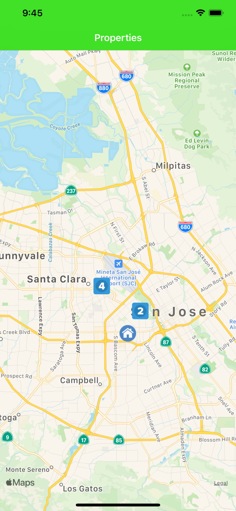
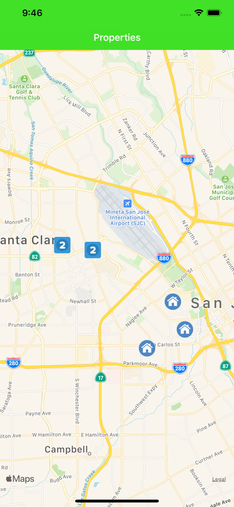
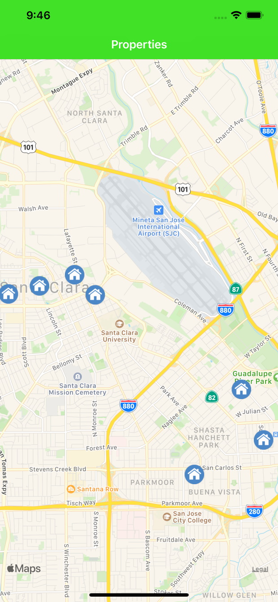

# Mapping Properties

Sample app that demonstrates dynamically updating UIMapKit pins when user scroll / zooms the map. Written in Swift 5.

***

### Default view - one property is displayed individually, others are close enough to other properties that they are displayed as a group to prevent clutter

### Partially zoomed in - some properties have regrouped, or left group

### Zoomed in - all properties shown individually

***

## License

Mapping Properties is licensed under the MIT License. See the LICENSE file for more information, but basically this is sample code and you can do whatever you want with it.